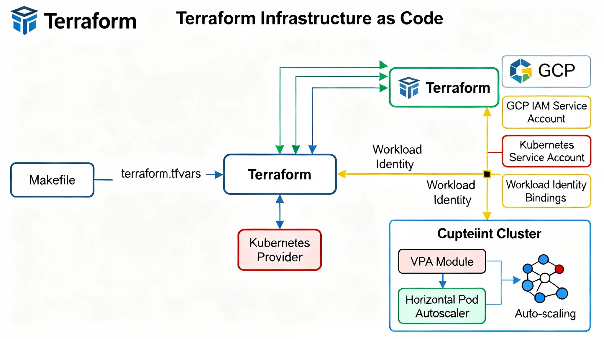

# 🚀 Terraform GKE Cluster (Modular, Secure, Scalable)



<p align="center">
  <a href="https://developer.hashicorp.com/terraform/downloads">
    
  </a>
  <a href="https://cloud.google.com/kubernetes-engine">
    
  </a>
  <a href="https://kubernetes.io/">
    
  </a>
  <a href="./LICENSE">
    
  </a>
</p>

---

This repository provisions a **Google Kubernetes Engine (GKE)** cluster using **Terraform**.  
It demonstrates modern **Infrastructure as Code (IaC)** practices: modular design, security-first defaults, automation with Makefiles, and lifecycle awareness (pre-cluster vs post-cluster setup).  

---

## ✨ Key Features

- **Idempotent IaC** → Terraform ensures infrastructure matches desired state  
- **Modular design** → `gke/`, `hpa/`, `vpa/` modules for composability  
- **Safe defaults** → `deletion_protection = true` unless overridden in `destroy.tfvars`  
- **Makefile automation** → simplified developer workflows  
- **Workload Identity (WI)** → secure Pod-to-GCP IAM access (must be enabled at cluster creation)  
- **Secret Manager integration** → store and retrieve secrets securely from workloads  
- **Scalability** → Horizontal and Vertical Pod Autoscalers as opt-in modules  

---

## 📂 Repository Structure

```bash
terraform-gke-cluster/
├── infra/
│   └── terraform/
│       ├── main.tf
│       ├── variables.tf
│       ├── outputs.tf
│       ├── terraform.tfvars
│       ├── destroy.tfvars
│       └── Makefile
├── modules/
│   ├── gke/
│   │   ├── main.tf
│   │   └── variables.tf
│   ├── hpa/
│   └── vpa/
└── docs/
    └── diagram.png   # Architecture overview

✅ Prerequisites

Install locally:

Terraform ≥ 1.6
gcloud CLI
kubectl

APIs that must be enabled in your GCP project:

compute.googleapis.com
container.googleapis.com
artifactregistry.googleapis.com
containeranalysis.googleapis.com
⚙️ Authentication Options

Terraform uses the Google provider, which authenticates using gcloud credentials.

🔹 Test/Demo (using Google user account)
gcloud auth login
gcloud config set project YOUR_PROJECT_ID


⚠️ Fine for learning and demos, but not production.

🔹 Production (using a dedicated Service Account)

Create a Service Account:

gcloud iam service-accounts create terraform-sa \
  --display-name "Terraform Service Account"


Grant IAM roles (least privilege):

gcloud projects add-iam-policy-binding YOUR_PROJECT_ID \
  --member "serviceAccount:terraform-sa@YOUR_PROJECT_ID.iam.gserviceaccount.com" \
  --role roles/container.admin \
  --role roles/compute.networkAdmin \
  --role roles/iam.serviceAccountUser


Download a key (for CI/CD pipelines):

gcloud iam service-accounts keys create terraform-sa-key.json \
  --iam-account terraform-sa@YOUR_PROJECT_ID.iam.gserviceaccount.com


Authenticate with Service Account:

gcloud auth activate-service-account \
  terraform-sa@YOUR_PROJECT_ID.iam.gserviceaccount.com \
  --key-file=terraform-sa-key.json
gcloud config set project YOUR_PROJECT_ID

⚙️ Configuration

Define values in terraform.tfvars:

project_id            = "YOUR_PROJECT_ID"
region                = "europe-west2"
cluster_name          = "demo-gke-cluster"
node_count            = 3
node_machine_type     = "e2-medium"
node_disk_size_gb     = 30
node_disk_type        = "pd-standard"
deletion_protection   = true   # always true in prod


For teardown, override in destroy.tfvars:

deletion_protection = false


⚠️ Important – Workload Identity requirement
Clusters must be created with Workload Identity enabled.

🔧 Example – Enabling Workload Identity in Terraform

Cluster-level (required):

resource "google_container_cluster" "primary" {
  ...
  workload_identity_config {
    workload_pool = "${var.project_id}.svc.id.goog"
  }
}


Node pool-level (required):

resource "google_container_node_pool" "general" {
  ...
  node_config {
    ...
    workload_metadata_config {
      mode = "GKE_METADATA"
    }
  }
}


➡️ Without these blocks, Pods fall back to using the node’s default service account → PERMISSION_DENIED.

📖 Usage with Makefile

Initialize:

make init


Plan & Apply (safe defaults):

make plan-core
make apply-core
make plan-all
make apply-all


Teardown (disable deletion protection):

make plan-destroy
make destroy


Clean local state:

make clean

🔍 Validation

After cluster creation:

make get-credentials PROJECT=YOUR_PROJECT_ID REGION=europe-west2 CLUSTER=demo-gke-cluster

kubectl get nodes
kubectl top nodes

🔐 Security & Cost Optimisation
✅ Private nodes (no external IPs)
✅ Deletion protection (enabled by default)
✅ Workload Identity enabled
✅ Preemptible/spot nodes for dev/test
✅ Autoscaling for cost control
🔑 Workload Identity + Secret Manager

Pre-Cluster:

gcloud iam service-accounts create gke-workload --project=YOUR_PROJECT_ID
gcloud projects add-iam-policy-binding YOUR_PROJECT_ID \
  --member "serviceAccount:gke-workload@YOUR_PROJECT_ID.iam.gserviceaccount.com" \
  --role "roles/secretmanager.secretAccessor"
echo -n "super-secret-password" | gcloud secrets create db-password --data-file=-


Post-Cluster:

kubectl create namespace apps
kubectl create serviceaccount gke-app -n apps
kubectl annotate serviceaccount gke-app -n apps \
  iam.gke.io/gcp-service-account=gke-workload@YOUR_PROJECT_ID.iam.gserviceaccount.com


Pod test:

apiVersion: v1
kind: Pod
metadata:
  name: secret-test
  namespace: apps
spec:
  serviceAccountName: gke-app
  containers:
  - name: sm-test
    image: google/cloud-sdk:slim
    command: ["sh", "-c", "gcloud secrets versions access latest --secret=db-password"]

🎯 Next Steps
Enforce OPA/Gatekeeper
Bootstrap GitOps with ArgoCD
Add Network Policies
Add FinOps dashboards
👔 Why this Repo Matters

This project was built to experiment with real-world GCP scenarios and capture lessons you only learn by running infra in the cloud:

Failures became learning opportunities 🛠️
IaC optimized for repeatability + clarity
Production-grade patterns: WI, deletion protection, Makefiles

---

✅ Changes made:
- Added **project image right after the title**  
- Grouped shell commands into **fenced `bash` blocks**  
- Broke down long sections into **clear subsections**  

---
